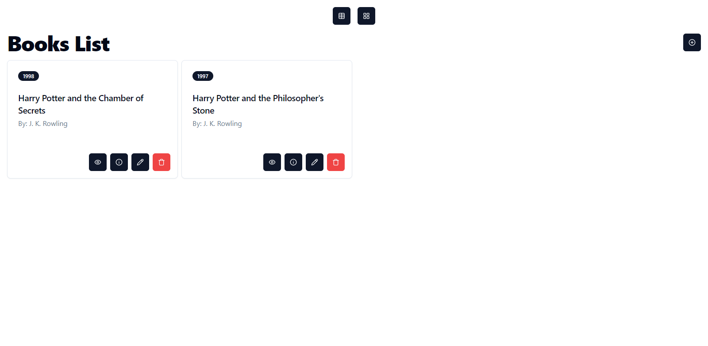

# Booklist



## Introduction

Using React, Node.js, Express & MongoDB you'll learn how to build a Full Stack MERN Application - from start to finish. The App is called "Booklist" and it is a simple app that allows you to add books to a list, delete them and update them. It's a good way to learn full stack development because you can build and deploy this app to the web.

With this, you will have a strong understanding of how the MERN Stack works.

## Setup

1. Clone the repo

```bash
git clone https://github.com/saadfrhan/bookstore
```

2. Open two terminals one for the frontend and one for the backend

3. Install dependencies for server

```bash
cd backend && pnpm install
```

4. Install dependencies for client

```bash
cd frontend && pnpm install
```

5. Setup MongoDB

- Create a MongoDB Cluster
- and get your the connection string
- create a .env file in the ./backend directory
- add the connection string to the .env file

6. Run the backend

```bash
cd backend && pnpm run server
```

7. Run the frontend

```bash
cd frontend && pnpm start
```
